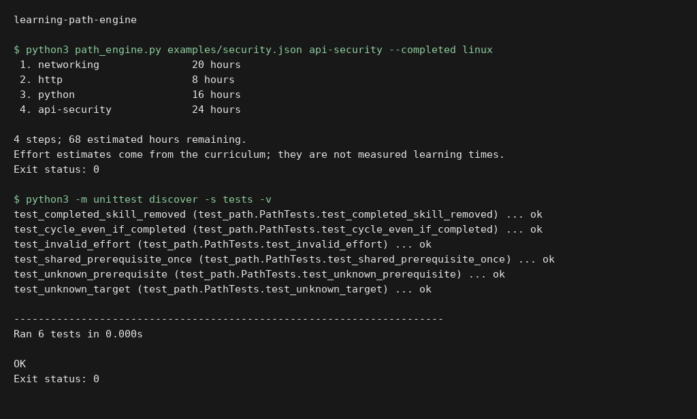

# Learning path engine

Build a study plan from a local curriculum with prerequisites and effort estimates. Shared prerequisites appear once; completed skills are omitted; unknown skills and cycles are rejected.

```sh
python path_engine.py examples/security.json api-security --completed linux
python -m unittest discover -s tests -v
```

The example estimates are planning inputs, not measured learning times. The engine does not rank courses or make claims about certification eligibility.

## Execution preview



Local execution of `python3 path_engine.py examples/security.json api-security --completed linux`. The input and output shown come from the repository example or test fixtures. [Verification](docs/verification.md).

